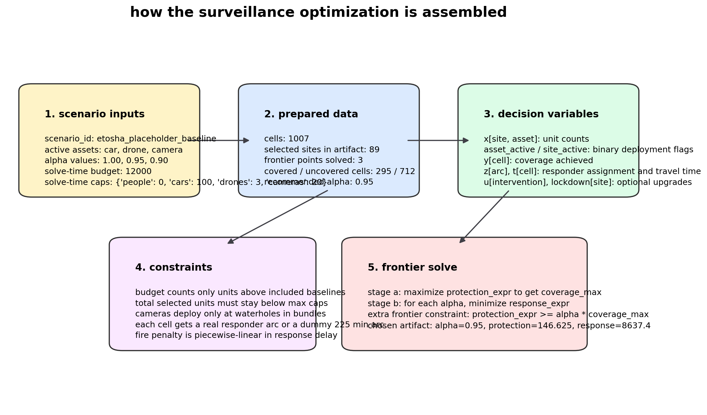
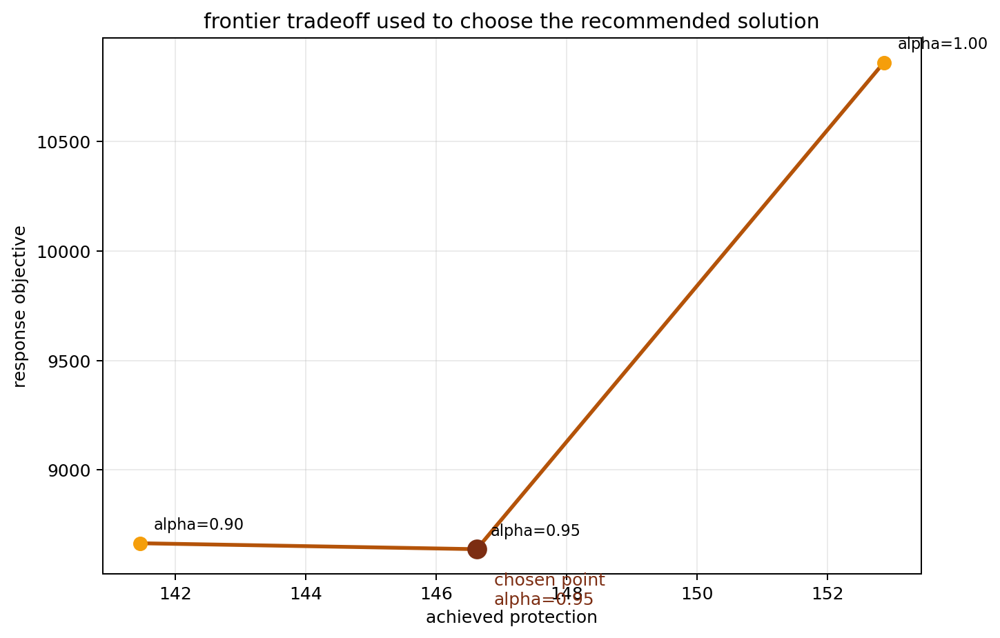
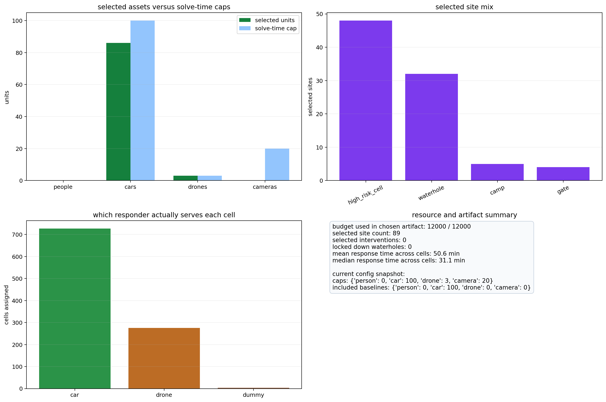
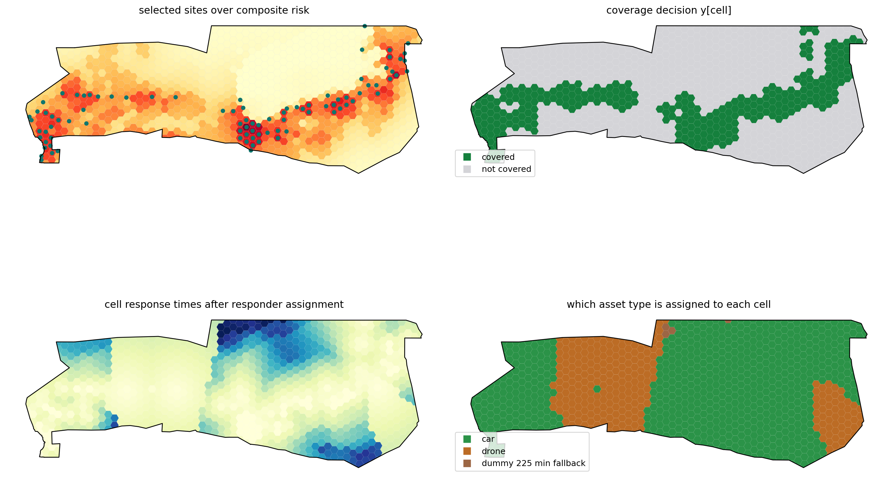
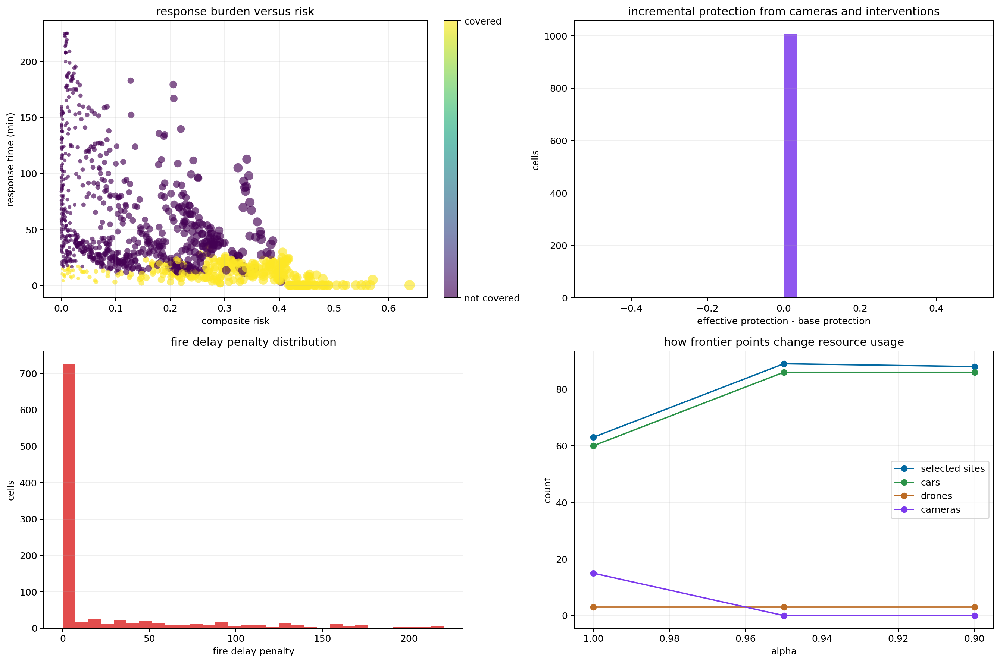

# optimization components walkthrough

this document is generated by `scripts/visualize_optimization_components.py`.
it explains how the optimization in `scripts/16_optimize_surveillance.py` works using the current output artifacts in `outputs/`.

## what problem the model is solving

the optimization is a two-stage mixed-integer model over Etosha surveillance deployment.
it first finds the maximum achievable protection score, then solves a response-minimization problem at multiple `alpha` levels while forcing protection to stay above a fraction of that maximum.

- scenario id: `etosha_placeholder_baseline`
- scenario description: `placeholder optimization scenario for phase 1 schema validation`
- active asset types: `car, drone, camera`
- alpha values: `1.00, 0.95, 0.90`
- solve-time budget from artifact: `12000`
- recommended alpha: `0.95`



## the main data objects

the model works over several linked object sets:

- sites: candidate deployment locations chosen earlier in the pipeline
- site-asset pairs: only site/asset combinations that are physically eligible
- cells: the gridded landscape units being protected and responded to
- response arcs: the top few feasible site-to-cell responder routes
- interventions: optional waterhole actions with capital cost and tourism penalty
- waterhole camera sites: the subset of sites that can host camera lockdown bundles

for the current artifact:

- cells in optimization output: `1007`
- selected sites in chosen solution artifact: `89`
- covered cells: `295`
- uncovered cells: `712`
- responder assignment counts: `car=727, drone=276, dummy 225 min fallback=4`

## decision variables and what they mean

the important variables in the Pyomo model are:

- `x[site, asset]`: how many units of an asset to place at a site
- `asset_active[site, asset]`: whether that site/asset combination is turned on
- `site_active[site]`: whether a site incurs its fixed activation cost
- `y[cell]`: whether a cell is considered covered
- `z[arc]`: which real responder arc is assigned to a cell
- `dummy[cell]`: whether the fallback 225-minute response is used instead of a real arc
- `t[cell]`: realized response time for the cell
- `fire_lambda[cell, breakpoint]` and `fire_penalty[cell]`: the piecewise-linear wildfire delay approximation
- `u[intervention]`: whether a waterhole intervention is purchased
- `lockdown[site]`: whether a camera bundle is activated at an eligible waterhole site

## key constraints

the model structure matters more than the exact coefficients:

1. site/asset linkage:
   `x` is upper-bounded by `max_units_per_site * asset_active`, and mobile assets also have a lower link so an active asset implies at least one unit.
2. camera bundles:
   cameras are not free-form counts. if a waterhole is locked down, the camera count is forced to exactly `camera_bundle_size * lockdown`.
3. budget:
   the budget includes fixed site activation cost, capital cost for interventions, and only the asset units above the configured `included_*` baseline.
4. asset caps:
   total units by asset type must stay below `max_people`, `max_cars`, `max_drones`, and `max_cameras`.
5. coverage feasibility:
   a cell can only be marked covered if at least one eligible mobile asset is active on one of the site-asset pairs that covers it.
6. response assignment:
   every cell must choose either one real response arc or the dummy fallback arc.
7. response-time interpolation:
   `t[cell]` equals the selected response arc time, or 225 minutes for dummy service.
8. wildfire penalty interpolation:
   `fire_lambda` forms a simplex over breakpoints so the model can linearly represent the fire delay penalty curve.

## objective functions

the model uses two objective expressions:

- `protection_expr`
  - base protection for covered cells
  - plus camera gain at locked-down waterholes
  - plus intervention protection gain

- `response_expr`
  - composite-risk-weighted response time
  - plus `lambda_fire * wildfire_risk * fire_delay_penalty`
  - plus tourism penalty from selected interventions

the frontier algorithm is:

1. maximize `protection_expr` with no coverage floor to get `coverage_max`
2. for each `alpha`, solve a second model minimizing `response_expr`
3. add the frontier constraint `protection_expr >= alpha * coverage_max`
4. keep the recommended point at the configured alpha index



## frontier results from the current artifact

| alpha | coverage_target | achieved_protection | response_objective | budget_used | selected_site_count | selected_people | selected_cars | selected_drones | selected_cameras | selected_interventions |
| --- | --- | --- | --- | --- | --- | --- | --- | --- | --- | --- |
| 1.000 | 152.858 | 152.868 | 10861.151 | 11950.000 | 63.000 | 0.000 | 60.000 | 3.000 | 15.000 | 1.000 |
| 0.950 | 145.215 | 146.625 | 8637.438 | 12000.000 | 89.000 | 0.000 | 86.000 | 3.000 | 0.000 | 0.000 |
| 0.900 | 137.573 | 141.460 | 8664.587 | 11925.000 | 88.000 | 0.000 | 86.000 | 3.000 | 0.000 | 0.000 |

the chosen artifact is the `alpha=0.95` point:

- achieved protection: `146.625`
- response objective: `8637.438`
- budget used: `12000.0`
- selected sites: `89`
- selected people: `0`
- selected cars: `86`
- selected drones: `3`
- selected cameras: `0`
- selected interventions: `0`

## resource interpretation

the table below combines the chosen artifact counts with solve-time caps from `optimization_summary.json`.
if the current config is different, that difference is shown explicitly so you can tell whether you are looking at stale outputs.

| asset_type | selected_units | solve_time_cap | current_config_cap | current_included_baseline | unit_cost |
| --- | --- | --- | --- | --- | --- |
| people | 0 | 0 | 0 | 0 | 570.000 |
| cars | 86 | 100 | 100 | 100 | 450.000 |
| drones | 3 | 3 | 3 | 0 | 800.000 |
| cameras | 0 | 20 | 20 | 0 | 90.000 |

notes:

- `selected_units` comes from the chosen frontier point in the output artifact.
- `solve_time_cap` comes from the saved summary generated by the solve that produced the artifact.
- `current_config_cap` and `current_included_baseline` come from the live `daily_asset_availability.yaml` in the workspace right now.
- `unit_cost` comes from `asset_types.yaml`.
- the exact budget decomposition cannot always be reconstructed from the output artifact alone because the summary saves caps but not all included baseline values used at solve time.



## spatial interpretation of the chosen solution

the optimization does not just choose counts; it chooses where those resources sit and which cells they actually serve.

- the upper-left panel shows selected sites on top of the composite risk field.
- the upper-right panel shows which cells satisfied the binary coverage logic.
- the lower-left panel shows realized response time after the responder assignment step.
- the lower-right panel shows whether each cell is served by an active responder asset type or the dummy fallback.



## cell-level behavior

the cell diagnostics highlight how the objective is assembled:

- high-risk cells with long response times are expensive in `response_expr`
- camera and intervention gains raise effective protection above base protection
- fire delay penalty adds extra cost when response times cross the configured threshold region
- different alpha points change the selected site count and the car/drone/camera mix

artifact summary statistics:

- response time min / p25 / median / p75 / max:
  - `0.50` / `15.91` / `31.08` / `69.31` / `225.00`
- mean incremental protection gain:
  - `0.0000`
- max incremental protection gain:
  - `0.0000`



## what this walkthrough says about the current solve

- the artifact is clearly a frontier solve, not a single-objective solve: response gets much better when alpha drops from `1.00` to `0.95`, while protection only drops slightly.
- the chosen artifact is driven by `86 cars, and 3 drones`, with `4` cells still falling back to the dummy response.
- because the current config and current output artifact disagree on some caps, this walkthrough should be read as an explanation of the saved artifact, not as proof that the current config would reproduce the same answer.

## how to regenerate

run:

```bash
./.venv/bin/python scripts/visualize_optimization_components.py
```

this will regenerate:

- `outputs/optimization_components/01_model_structure.png`
- `outputs/optimization_components/02_frontier_tradeoff.png`
- `outputs/optimization_components/03_resource_summary.png`
- `outputs/optimization_components/04_spatial_solution.png`
- `outputs/optimization_components/05_cell_metrics.png`
- `outputs/optimization_components/optimization_components.md`
